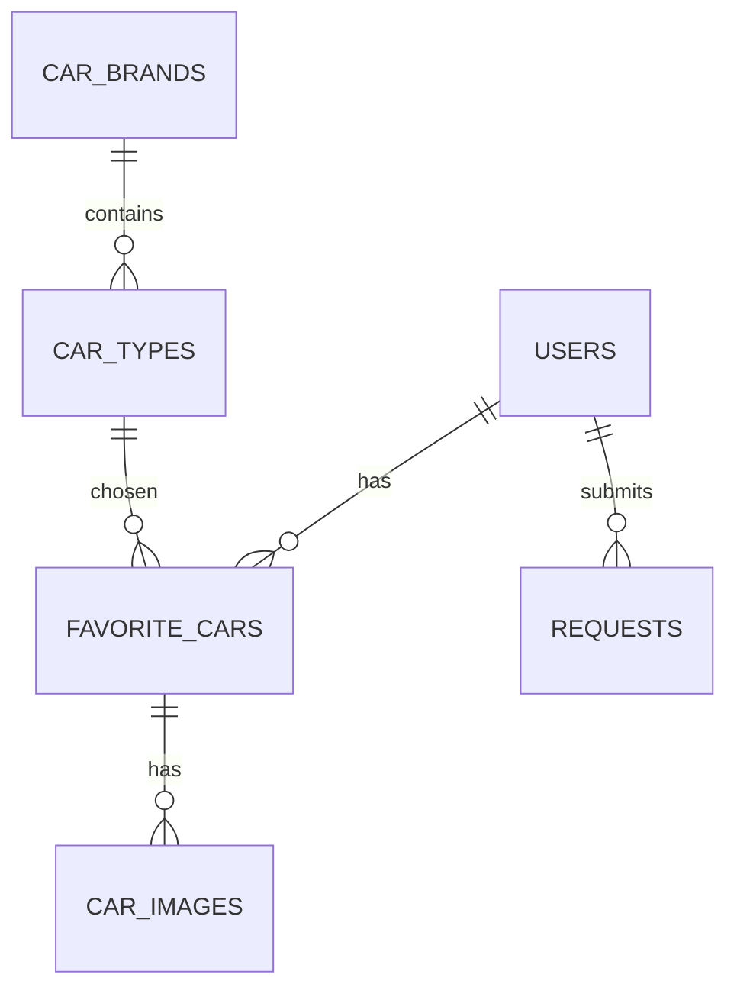

# 🚗 Car Management Web Application (Laravel)

This project is a **web application built with Laravel**, designed to allow users to manage their favorite cars.  
The system distinguishes between two roles: **user** and **administrator (admin)**.  
Users can register, log in, manage their favorite cars, upload pictures, and request new car brands.  
Administrators can manage users (CRUD), approve deletion requests, unlock locked accounts, and expand the car brand database.  
The application has been built with security in mind (password hashing, CSRF protection, SQL injection prevention).  

---

## ✨ Features

### Public Pages
- **Homepage** with description and image
- **Login** and **Registration**

### User Features
- Registration (name, username, password with validation)
- Login (only active accounts)
- Account locks after 5 failed login attempts
- Manage favorite cars (**CRUD**)
- Upload images for cars
- Request new car brand if missing
- Request account deletion

### Admin Features
- Admin panel accessible only by admin users
- Manage users (**CRUD**, activation, lock/unlock)
- Approve or reject user deletion requests
- Unlock locked accounts
- Add new car brands
- Create new users (both admin and user roles)
- Manage user requests

---

## 🗄️ Database Structure

### `users` (Users)
- id (PK, auto increment)
- username (unique)
- password (hashed)
- name (string)
- type (enum: admin, user)
- is_active (bool)
- login_attempts (int)

### `car_brands` (Car Brands Dictionary)
- id (PK)
- name (string)

### `car_types` (Car Models Dictionary)
- id (PK)
- brand_id (FK → car_brands.id)
- name (string)

### `favorite_cars` (Favorite Cars)
- id (PK)
- user_id (FK → users.id)
- model_id (FK → car_types.id)
- year (int)
- color (string)
- fuel (string)

### `car_images` (Car Images)
- id (PK)
- favorite_car_id (FK → favorite_cars.id)
- image (varbinary/blob)

---

## 🔐 Security

- Passwords stored as **bcrypt hashes**
- Laravel **CSRF token protection**
- **SQL injection prevention** via Eloquent ORM
- Server-side validation on all forms
- Accounts locked after 5 failed login attempts

---

## ⚙️ Installation

1. **Requirements**
   - PHP 8.1+
   - Composer
   - MySQL / SQLite
   - Node

2. **Clone and install**
   ```bash
   git clone https://github.com/username/car-registry.git
   cd car-registry
   composer install
   cp .env.example .env
   php artisan key:generate
   ```

3. **Database setup**
   Edit `.env` file:
   ```
   DB_CONNECTION=mysql
   DB_HOST=127.0.0.1
   DB_PORT=3306
   DB_DATABASE=car_registry
   DB_USERNAME=root
   DB_PASSWORD=
   ```

   Run migrations and seeders:
   ```bash
   php artisan migrate --seed
   ```

   Default admin account:
   ```
   Username: admin
   Password: Admin123!
   ```

4. **Run the server**
   ```bash
   php artisan serve
   ```
   The app will be available at: [http://localhost:8000](http://localhost:8000)

---

## 👤 User Guide

### User
- Register and log in
- Manage favorite cars
- Upload pictures for cars
- Request new car brand
- Request account deletion

### Admin
- Manage users (add, edit, delete, lock/unlock, set role)
- Approve or reject user requests
- Unlock locked accounts
- Add new car brands

---

## 📊 Database Diagram



---

## 📌 Requirements Coverage
✅ Functionalities (CRUD, login, registration, image handling, requests)  
✅ Security (hashing, CSRF, validation, SQL injection prevention)  
✅ Documentation (installation, user/admin guide, DB diagram)  
✅ Separation of concerns (Laravel MVC structure)  

---

## 🏆 Summary

The goal of this project is to provide a **clear, secure, and extendable car management system**, built with Laravel, that fulfills the assignment requirements and is easy to install and use.
