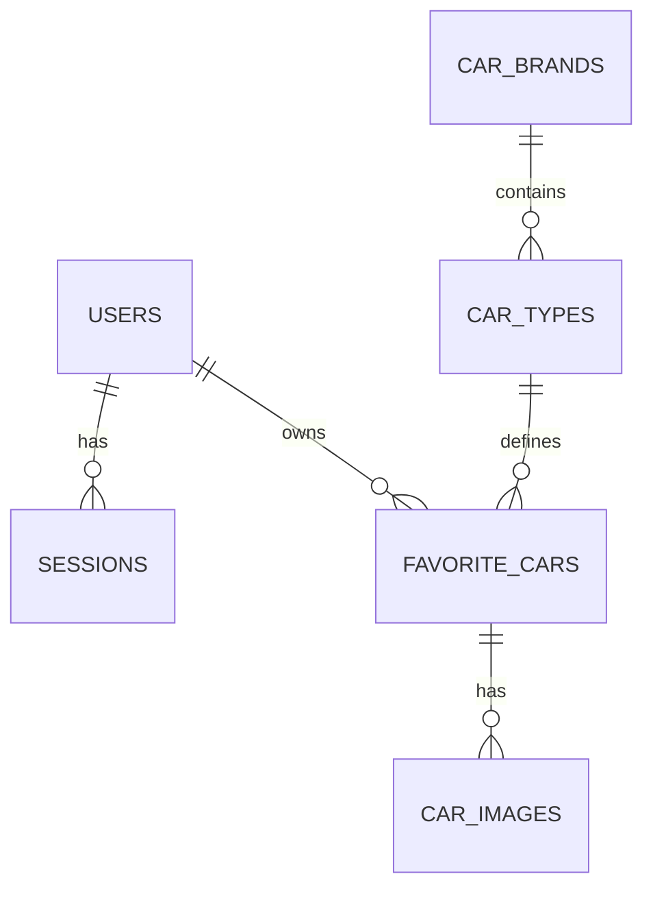
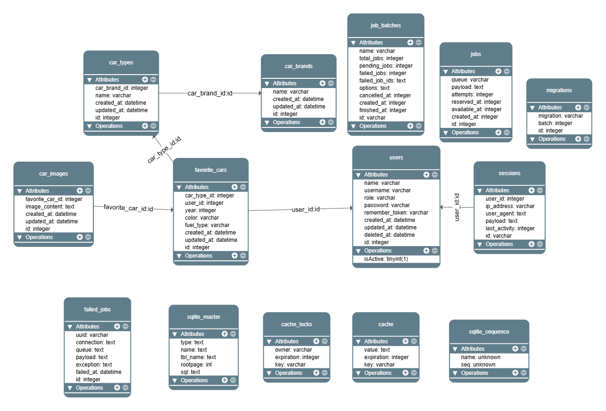

# 🚗 Car Management Web Application (Laravel)

This project is a **web application built with Laravel**, designed to allow users to manage their favorite cars.  
The system distinguishes between two roles: **user** and **administrator (admin)**.  
Users can register, log in, manage their favorite cars, upload pictures, and request new car brands.  
Administrators can manage users (CRUD), approve deletion requests, unlock locked accounts, and expand the car brand database.  
The application has been built with security in mind (password hashing with salt, CSRF protection, SQL injection prevention).  

---

## ✨ Features

### Public Pages
- **Homepage** with description and image
- **Login** and **Registration**

### User Features
- Registration (name, username, password with validation)
- Login (only active accounts)
- Manage favorite cars (**CRUD**)
- Upload images for cars
- Request new car brand if missing
- Request account deletion

### Admin Features
- Admin panel accessible only by admin users
- Manage users (**CRUD**, activation, lock/unlock)
- Approve or reject user deletion requests
- Unlock locked accounts
- Add new car brands
- Create new users (both admin and user roles)
- Manage user requests

---

## 🗄️ Database Structure

### `users` (Users)
- id (PK, auto increment)
- username (unique, hashed)
- password (hashed)
- name (string)
- type (enum: admin, user)
- is_active (bool)
- deleted_at (datetime)

### `car_brands` (Car Brands Dictionary)
- id (PK)
- name (string)

### `car_types` (Car Models Dictionary)
- id (PK)
- brand_id (FK → car_brands.id)
- name (string)

### `favorite_cars` (Favorite Cars)
- id (PK)
- user_id (FK → users.id)
- model_id (FK → car_types.id)
- year (int)
- color (string)
- fuel (string)

### `car_images` (Car Images)
- id (PK)
- favorite_car_id (FK → favorite_cars.id)
- image (varbinary/blob)

---

## 🔐 Security

- Passwords stored as **bcrypt hashes with salt**
- Usernames hashed with **SHA256**
- Laravel **CSRF token protection**
- **SQL injection prevention** via Eloquent ORM
- Server-side validation on all forms
- Accounts locked after 5 failed login attempts

---

## ⚙️ Installation

- **Requirements**
    - [Git](https://git-scm.com/downloads)
    - [PHP](https://www.php.net/downloads)
    - [Composer](https://getcomposer.org/download/)
    - [Node.js](https://nodejs.org/en/download/)


- **Requirements** installation using script (only Windows Powershell)
```powershell
    #Powershell (Windows)
    Invoke-WebRequest -Uri "https://raw.githubusercontent.com/yurij90/pgy-cars/refs/heads/master/install.ps1" -OutFile ".\install.ps1"
    Set-ExecutionPolicy -Scope Process -ExecutionPolicy Bypass -Force; .\install.ps1 
```

### 1️⃣ Automatic Setup (Script)

**The script will ask for an admin user at startup!**

You can run a setup script to automatically configure the environment, create the database, run migrations, and seed default users.

- **Powershell (Windows):**
```powershell
git clone https://github.com/yurij90/pgy-cars.git
cd pgy-cars
Set-ExecutionPolicy -Scope Process -ExecutionPolicy Bypass -Force; .\setup.ps1
```

- **Bash (Linux/macOS, Git Bash):**
```bash
git clone https://github.com/yurij90/pgy-cars.git
cd pgy-cars
./setup.sh
```

### 2️⃣ Manual Setup

1. **Clone and install**
   ```powershell
   #Powershell (Windows)
   git clone https://github.com/yurij90/pgy-cars.git
   cd pgy-cars
   composer install
   npm install
   npm run build
   Copy-Item -Path .env.example -Destination .env
   php artisan key:generate
   ```
   ```bash
   #Bash (Linux/macOS, Git Bash)
   git clone https://github.com/yurij90/pgy-cars.git
   cd pgy-cars
   composer install
   npm install
   npm run build
   cp .env.example .env
   php artisan key:generate
   ```

2. **Database setup and server startup**
   ```bash
   php artisan migrate #creating empty sqlite
   php artisan migrate --seed
   composer run dev
   ```
   The app will be available at: [http://localhost:8000](http://localhost:8000)

---

Default **user** account:

- Username: user
- Password: user


Default **admin** account: (only works if you have **NOT** run the setup script)

- Username: admin
- Password: admin

---

## 👤 User Guide

### User
- Register and log in
- Manage favorite cars
- Upload pictures for cars
- Request new car brand
- Request account deletion

### Admin
- Manage users (add, edit, delete, lock/unlock, set role)
- Approve or reject user requests
- Unlock locked accounts
- Add new car brands

---

## 📊 Database Diagram



The following diagram illustrates the relationships between the tables in the database:



---

## 📌 Requirements Coverage
✅ Functionalities (CRUD, login, registration, image handling, requests)  
✅ Security (hashing, CSRF, validation, SQL injection prevention)  
✅ Documentation (installation, user/admin guide, DB diagram)  
✅ Separation of concerns (Laravel MVC structure)  

---

## 🏆 Summary

The goal of this project is to provide a **clear, secure, and extendable car management system**, built with Laravel, that fulfills the assignment requirements and is easy to install and use.
